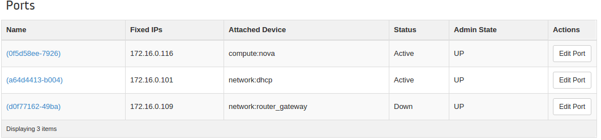
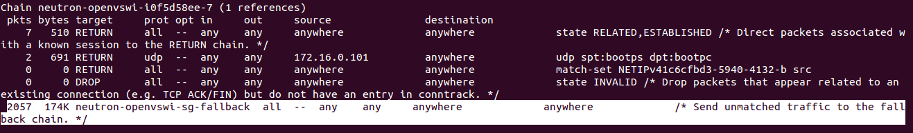

## 介绍

[Devstack](http://docs.openstack.org/developer/devstack/)是可以方便部署OpenStack的工具。但是默认是使用Nova Network，而Nova Network因为其功能上的局限性，已经逐渐被Neutron取代。我就结合自己的部署经验，写下这篇文章，当作是一个记录（年纪大了，发现脑袋是靠不住了:P）。

<!-- more -->

其实网上有很多介绍如何部署Neutron的文章，我觉得最有用的是[这一篇](http://xiaoquqi.github.io/blog/2015/09/03/devstack-guide/)，可能是因为自己的环境和这位博主很像吧。

下面先说说我的环境，

> #### Host: 
Ubuntu 15.10

> ##### VM: 
Vagrant部署的Ubuntu 14.04，hypervisor是VirtualBox, RAM: 2G。
网卡有三个，一个是vagrant自带的NAT网卡，另外两个是自己通过[Vagrantfile](https://drive.google.com/file/d/0B33oO277eVsLZzkyYTR3VGxza2M/view?usp=sharing)建的HostOnly的网卡。两个HostOnly的网卡，一个是用来做Openstack内部通信的10.0.0.10，另外一个是用来访问外网172.16.0.x（Host Only的网卡访问外网，需要在Host上启用NAT，具体方法参见上面的链接。172.16.0.x是分配给instance的floating IP，我们只需要知道网关地址，即Host上hostonlyif的IP，正常情况是172.16.0.1。）

## 准备工作

 1. 在VM里面新建一个账户，有sudo权限

 2. 配置网络
    Openstack需要一个OVS Bridge连接Internet，通常取名为br-ex，我们需要把这个bridge建出来，然后我们把用于连接Internet的网卡 (eth2: 172.16.0.10)加到br-ex里面，Bridge里面IP是配在Bridge上的，但是br-ex只是用来连接Internet，本身并不一定要求有IP地址，所以完全可以把eth2上的IP直接清掉。另外还需要一个bridge br-pri用来openstack内部的通信，这个bridge是需要一个IP地址的，最为Host IP，很多服务会起在这个IP上面。

        sudo ovs-vsctl add-br br-ex
        sudo ovs-vsctl add-port br-ex eth2
        sudo ovs-vsctl add-br br-pri
        sudo ovs-vsctl add-port br-pri eth1
        sudo ifconfig eth1 0.0.0.0
        sudo ifconfig eth2 0.0.0.0
        sudo ifconfig br-pri 10.1.1.10/24
    
    这里有个问题是因为eth1和eth2是通过Vagrantfile建立的，所以每次重启vm，IP地址都会被重新配上。所以需要写个script在启动的时候把这两块网卡上的IP地址清除，同时这个脚本会把br-pri的地址也一起配置上。我的脚本[fluship](https://drive.google.com/file/d/0B33oO277eVsLVUJTbWozZjRNTlk/view?usp=sharing)是放在`/etc/network/if-up.d/`下面的

        #!/bin/sh

        ifconfig eth1 0.0.0.0

        ifconfig eth2 0.0.0.0

        ifconfig br-pri 10.1.1.10/24
    
 3. 下载devstack，我用的是stable的kilo版本, liberty也适用

     `git clone https://git.openstack.org/openstack-dev/devstack -b stable/kilo`
     
 4. 配置自己的local.conf文件，放在devstack目录下，我的配置如下

        [[local|localrc]]
        ADMIN_PASSWORD=test
        MYSQL_PASSWORD=$ADMIN_PASSWORD
        DATABASE_PASSWORD=$ADMIN_PASSWORD
        RABBIT_PASSWORD=$ADMIN_PASSWORD
        SERVICE_PASSWORD=$ADMIN_PASSWORD
        SERVICE_TOKEN=$ADMIN_PASSWORD

        HOST_IP=10.1.1.10
        disable_service n-net
        ENABLED_SERVICES+=,q-svc,q-agt,q-dhcp,q-l3,q-meta
        
        #Enable ML2 VLAN
        Q_PLUGIN=ml2
        ENABLE_TENANT_VLANS=True
        #Needed if you want to deploy VLAN
        Q_ML2_TENANT_NETWORK_TYPE=vlan
        
        ML2_VLAN_RANGES=private:1000:2000
        Q_ML2_PLUGIN_MECHANISM_DRIVERS=openvswitch
        Q_ML2_PLUGIN_TYPE_DRIVERS=flat,vlan
        ENABLE_TENANT_TUNNELS=False
        
        # ml2+ovs+vlan, if not configured, error happened: binding:vif_type=binding_failed
        OVS_BRIDGE_MAPPINGS=public:br-ex,private:br-pri
        
        FIXED_RANGE=20.0.0.0/24
        NETWORK_GATEWAY=20.0.0.1
        FLOATING_RANGE=172.16.0/24
        PUBLIC_NETWORK_GATEWAY=172.16.0.1
        Q_FLOATING_ALLOCATION_POOL=start=172.16.0.101,end=172.16.0.200

 5. (Optional) 修改apt源，换成国内的源，原因么，大家都懂的。

 6. (Optional) 在Host(或者其他可达的机器，我是用的lxd container)上配置PyPI cache。这个主要是为了，后面再部署的时候，可以更快一些。教程可以参考[这篇](http://doc.devpi.net/latest/quickstart-pypimirror.html)。
 
## 部署

准备工作做好了，部署其实很简单了，直接运行stack.sh就好了:-)

## 后续

部署完成后，默认会创建一个public network和private network。但是Type都是VLAN，因为是在笔记本的VM里部署的OpenStack环境，所以我又另外创建了一个Flat的public network，然后在这个网络里创建instance来验证网络功能。
都创建完成之后，这个Network里面的Port有4个，其中一个是Gateway 172.16.0.1，这个是我们配置的，本身就在Host上，所以不用验证其连通性。剩下三个如下图所示，

在验证网络功能之前，建议大家可以先了解下Neutron的网络架构，网上教程挺多的，我推荐我看到的[这篇](https://yeasy.gitbooks.io/openstack_understand_neutron/content/vlan_mode/network_node.html)，但不代表是最好的。

言归正传我尝试在Host去ping了提供DHCP服务的端口和Router Gateway，都是没有问题的，但是我却始终无法ping通我创建的instance 172.16.0.116。最后还是花了点时间去定位这个问题。

首先我发现在host是学到了10.240.0.116的ARP的

    lolipop@lolipop-ThinkPad-X250:~$ arp -an
    ? (172.16.0.116) at fa:16:3e:7d:8a:6d [ether] on vboxnet0
    ? (172.16.0.109) at fa:16:3e:13:01:3c [ether] on vboxnet0
    ? (172.16.0.101) at fa:16:3e:4c:07:88 [ether] on vboxnet0

（其实这里基本已经可以确定是iptables搞的鬼了，因为ARP能学到，至少说明链路是没有问题的。但我们还是费点时间，看看ICMP报文走过的路径吧）
ICMP报文从Host进来，首先到达的是eth2，eth2是br-ex上的一个口，我们可以通过ovs的命令来看统计，

    stack@all-in-one:~/devstack$ sudo ovs-ofctl dump-flows br-ex
    NXST_FLOW reply (xid=0x4):
      cookie=0x0, duration=2396.568s, table=0, n_packets=35, n_bytes=2774, idle_age=6, priority=4,in_port=1,dl_vlan=2 actions=strip_vlan,NORMAL
      cookie=0x0, duration=2459.369s, table=0, n_packets=36, n_bytes=2904, idle_age=2001, priority=2,in_port=1 actions=drop
      cookie=0x0, duration=2459.738s, table=0, n_packets=285, n_bytes=27950, idle_age=0, priority=1 actions=NORMAL

多观察几次，会发现匹配的是最后一个flow，所以ICMP并没有在这里被Drop。

接着往后看，br-ex是连接到br-int上的，我们可以用同样的方法观察br-int上flow统计，会发现匹配到了这样一条规则，

    cookie=0x0, duration=2800.657s, table=0, n_packets=687, n_bytes=67112, idle_age=0, priority=3,in_port=1,vlan_tci=0x0000 actions=mod_vlan_vid:2,NORMAL

虽然是Flat模式，但是到br-int上，都会映射到一个VLAN上。我们可以通过`sudo ovs-ofctl show br-int`看到in_port 1正是br-int和br-ex连接的端口int-br-ex。所以初步判定ICMP报文也并没有在这里被Drop掉。

br-int要连到instance，还需要经过linux bridge，我们先看看是哪个bridge，

    stack@all-in-one:~/devstack$ brctl show
    bridge name	    bridge id	     STP enabled	interfaces
    docker0        8000.56847afe9799    no		
    qbr0f5d58ee-79 8000.d235cb0f1967    no             qvb0f5d58ee-79
                                                       tap0f5d58ee-79
    virbr0         8000.000000000000    yes

可以确定，我们创建的instance用的bridge qbr0f5d58ee-79。上面有两个interface，tap是连接到instance的，qvb的是连接到br-int的。
用`sudo tcpdump -i qvb0f5d58ee-79`，会发现是收到ICMP报文了了。但用`sudo tcpdump -i tap0f5d58ee-79`，却发现只有ARP报文，可见ICMP报文是在linux bridge上丢弃的。

因为linux bridge本身的转发功能很简单，所以可以确定是ebtables/iptables的问题了，关于这部分，可以参考[文档](http://ebtables.netfilter.org/br_fw_ia/br_fw_ia.html)。
在这里，我们可以只关注filter table。首先看ebtables，发现里面并没有规则。然后看iptables。这里面，iptables有很多的Target，要慢慢的找，另外用iptables的-v选项是可以看到匹配到的报文统计的，可以帮助我们定位问题。
最终发现，问题出在neutron-openvswi-i0f5d58ee-7，如下图所示，

ICMP报文匹配的是最后一个默认规则，跳转到chain neutron-openvswi-sg-fallback，而这个chain是会丢弃所有报文的，

    Chain neutron-openvswi-sg-fallback (2 references)
     pkts bytes target     prot opt in     out     source               destination          2057  174K DROP       all  --  any    any     anywhere             anywhere             /* Default drop rule for unmatched traffic. */

可以看到统计计数也是吻合的。所以解决办法就是在iptables加条规则允许ICMP报文通过，如果需要ssh到instance的话，把ssh也打开。

至此，instance算是成功了。
当然，这里遇到的iptables的问题，也有可能是我的配置不对导致的。无论如何，这里的问题，让我对Neutron的网络架构有了一点了解。革命尚未成功，同志仍需努力！

