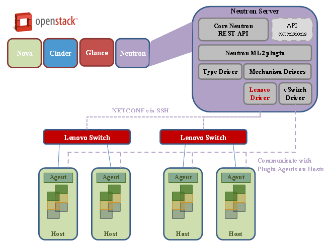

### Neutron

OpenStack里，有Nova-Network，但是Nova-Network的功能比较单一，无法达到"Networking as Service"的目的，因此产生了Neutron。Neutron的前身是Quantum，但是因为命名上的一些纠纷，后来改名为Neutron。

<!-- more -->

### ML2 plugin

ML2 (Modular Layer 2) plugin是Neutron的Core Plugin，主要是为了替换之前的一些L2相关的插件。ML2是一个框架，可以融合很多现有的L2技术。
ML2 Drivers定义了多种网络类型及其实现机制。

1. Type Drivers
定义了多种网络类型(Local, Flat, VLAN, GRE and VxLAN)，每个类型的网络有对应一个TypeDriver，维护了每个网络类型特有的一些状态与操作。

2. Mechanism Drivers
Mechanism Driver负责将Type Driver里维护的一些信息，真正的应用到底层的网络设备。这个网络设备可以是vSwitch，也可以是各个厂商的物理交换机，前提是这个厂商实现了对应的driver。
 
### Lenovo ML2 plugin

Lenovo ML2 plugin就是前面所说的Mechanism Driver。当用户创建instance并配置网络的时候，就会通过这个plugin对Lenovo的物理交换机做相应的配置。有了这个plugin，用户创建多个instance之后，不用再手动配置物理交换机，就能保证instance之间，以及instance与外网都是连通的。

### Lenovo ML2 plugin的部署
如果您是用Openstack社区的方法部署的Openstack环境，请参考Openstack Wiki上关于Lenovo ML2 plugin的部署方法：
[wiki](https://wiki.openstack.org/wiki/Neutron/ML2/LenovoML2Mechanism)

### Lenovo ML2 plugin的配置

部署完Lenovo ML2 plugin后，需要在plugin.ini文件中手动加上server与Lenovo Switch的连接关系，

    [ml2_mech_lenovo:10.240.179.65]
    # Hostname and port used on the switch for this compute host.
    nova-node-1 = portchannel:64
    # Port number where the SSH will be running on the Lenovo Switch. Default is 22 so this variable
    # only needs to be configured if different.
    ssh_port = 830
    # Provide the switch log in information
    username = admin
    password = admin

这个配置表示Server “nova-node-1”连接的Lenovo Switch的IP是10.240.179.65，连接到该Switch的portchannel 64。ssh_port 830是NETCONF的默认端口。username/password是管理交换机的用户名和密码。
配置完后，Lenovo ML2 plugin就可以正常使用了。

### Lenovo ML2 plugin的使用

ML2 plugin是在用户创建instance并绑定VLAN类型的Private Network网络的时候，对相应的Lenovo Switch进行配置。在GUI上并不能看到ML2 plugin的任何信息。相应的改变都发生在Lenovo Switch上面。
如果instance是建立在host “nova-node-1”的话，并且private network的segmentation(VLAN ID)是1000。
根据上一个章节的配置，可以得知这个server对应的switch的信息，ML2 plugin就会到对应的Switch 10.240.179.65上进行配置，

 - 如果VLAN 1000没有被创建，那个VLAN 1000会被创建出来。
 - Interface portchannel 64会被加到VLAN 1000里面。

这样的话，在同一个Segmentation里面的instance就可以互相访问了。

